class: inverse, center, middle

El material de esta charla está disponible en:

### [https://github.com/noeliarico/devfestspain2020](https://github.com/noeliarico/devfestspain2020)

---

.pull-left[

# Sobre esta charla

- Utilizaré código en [R](https://rstudio.cloud/learn/primers/1) y el [paquete `shiny`](http://shiny.rstudio.com)
- También [RStudio IDE](https://www.rstudio.com/products/rstudio/)

</br>


]

.pull-right[.right[
</br></br>

]]

--

### ¿Qué es shiny?
Shiny es un paquete de R que permite construir aplicaciones web interactivas a partir de scripts `.R`


---

# Comenzamos!

.pull-left[


</br>

Es necesario cargar el paquete<sup>1</sup>:

```{r eval=FALSE}
install.packages("shiny")
library(shiny)
```
.footnote[[1] Aunque si ejecutamos la aplicación desde RStudio Cloud la instalación se hará de forma automática si no se ha hecho previamente.]

]

.pull-right[

Nuestro **objetivo**:

- Crear un dashboard dinámico
- Conocer las partes y los elementos de una aplicación shiny
  - Cabecera y menú superior
  - Barra lateral
  - Cuerpo
- Customizar la aplicación
  - Colores
  - Layouts
]

---

.pull-left[
  </br>
  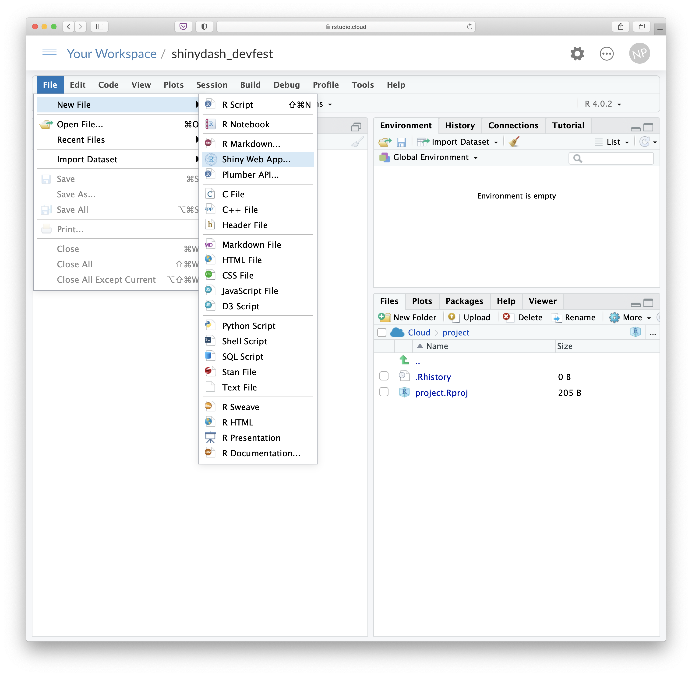
]

.pull-right[

</br></br>

# Creando un proyecto
</br>

- Podemos utilizar [RStudio IDE](www.google.es) o [RStudio Cloud](www.google.es)

- `File -> New file -> Shiny Web App`

- Esto crea un proyecto shiny, pero no un *dashboard*

]

---

.pull-left[
  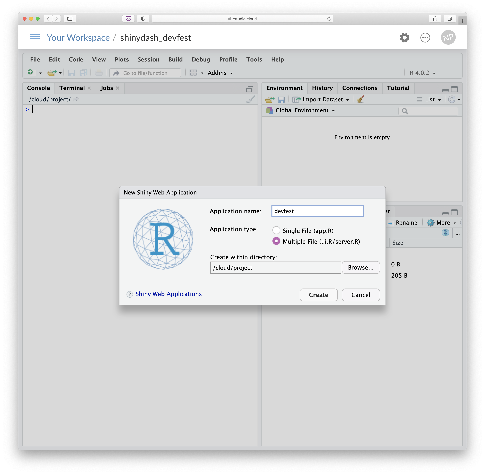
]

.pull-right[

</br>
# Arquitectura
</br>

Dos alternativas diferentes:

1. Utilizar un único fichero:
  - `app.R`
2. Tener dos ficheros distintos:
  - `ui.R`: interfaz de la aplicación
  - `server.R`: manipulación de código
]

.footnote[Las aplicaciones más complejas pueden ser divididas en más [módulos](https://shiny.rstudio.com/articles/modules.html) que faciliten la manipulación del código.]

---

.pull-more-left[
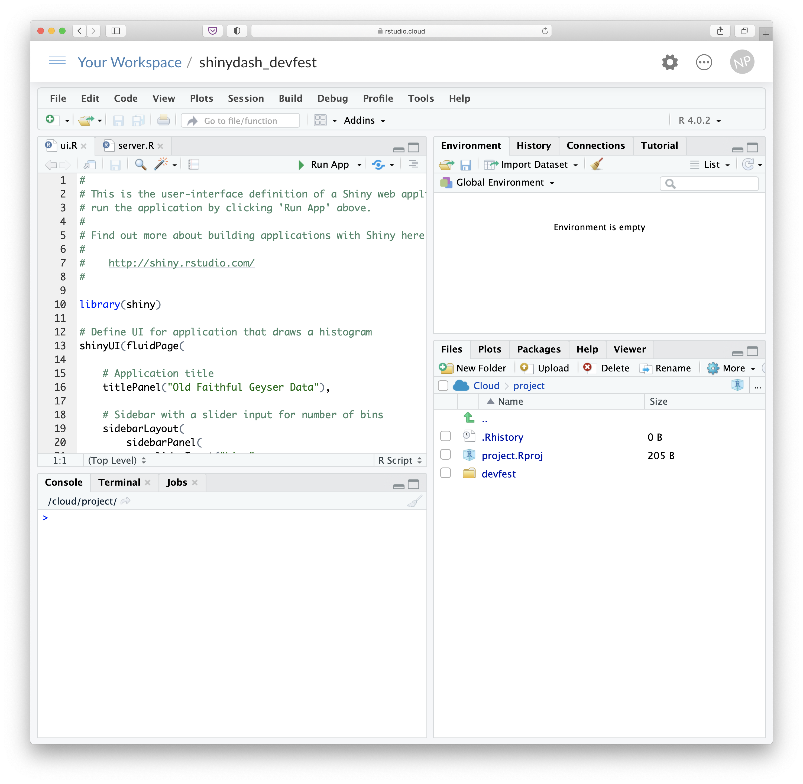
]


.pull-less-right[

</br></br>

## Después de crearlo tendremos:

- .Rproj
- Carpeta con el nombre que le hemos dado a nuestra aplicación que contiene los archivos `ui.R` y `server.R`

]

---

# Para lanzar la aplicación

Desde la barra de menú superior del editor podemos dar al botón ▶️ **Run App**:


</br>

Que realmente lo que hace es ejecutar el siguiente código en consola:

```{r eval=FALSE}
runApp('nombre_de_nuestra_app')
```

---

# Aplicación inicial

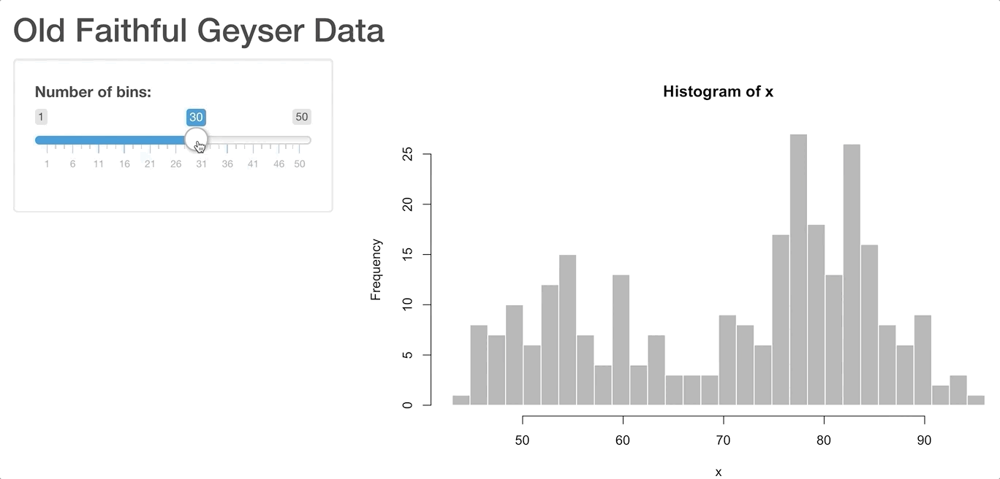

---

.pull-left[

# `ui.R`

.small1[
```{r eval=FALSE}
# This is the user-interface definition of a Shiny web application.
# You can run the application by clicking 'Run App' above.
# Find out more about building applications with Shiny here:
#
#    http://shiny.rstudio.com/

library(shiny)

# Define UI for application that draws a histogram
*shinyUI(fluidPage(

    # Application title
    titlePanel("Old Faithful Geyser Data"),

    # Sidebar with a slider input for number of bins
    sidebarLayout(
        sidebarPanel(
            sliderInput("bins",
                        "Number of bins:",
                        min = 1,
                        max = 50,
                        value = 30)
        ),
        # Show a plot of the generated distribution
        mainPanel(
            plotOutput("distPlot")
        )
    )
))
```
]]

.pull-right[

# `server.R`

.small1[
```{r eval=FALSE}
# This is the server logic of a Shiny web application. 
# You can run the application by clicking 'Run App' above.
#
# Find out more about building applications with Shiny here:
#
#    http://shiny.rstudio.com/
#

library(shiny)

# Define server logic required to draw a histogram
*shinyServer(function(input, output) {

    output$distPlot <- renderPlot({

        # generate bins based on input$bins from ui.R
        x    <- faithful[, 2]
        bins <- seq(min(x), max(x), length.out = input$bins + 1)

        # draw the histogram with the specified number of bins
        hist(x, breaks = bins, col = 'darkgray', border = 'white')

    })

})
```
]]

---

# Cambiando a dashboard
</br>

- Las aplicaciones shiny **no** son por defecto *dashboards*. 
- Para crear dashboards utilizando shiny, existen dos paquetes adicionales disponibles en `R`:

- [`shinydashboard`](http://rstudio.github.io/shinydashboard/index.html)
- [`flexdashboard`](https://rmarkdown.rstudio.com/flexdashboard/index.html)

</br>

Es necesario instalar el paquete:

```{r eval=FALSE}
install.packages("shinydashboard")
library(shinydashboard)
```


---

</br>
.pull-left[

# `ui.R`
</br>

```{r eval=FALSE}
library(shiny)
*library(shinydashboard)

*dashboardPage(
  dashboardHeader(),
  dashboardSidebar(),
  dashboardBody()
)
```
]

.pull-right[

# `server.R`
</br>

```{r eval=FALSE}
shinyServer(function(input, output) {


})
```
]


---


.pull-left[
</br>

]

.pull-right[

</br>
</br>
# Creando un dashboard vacío
</br>

- El dashboard se puede visualizar:
  - En una ventana del navegador
  - En la pestaña *Viewer* del panel inferior derecho
  
Se adaptará al tamaño de la ventana que se esté utilizando

]

---

# Elementos del dashboard

.pull-left[

# `ui.R`

```{r eval=FALSE}
library(shiny)
*library(shinydashboard)

*dashboardPage(
    dashboardHeader(),
    dashboardSidebar(),
    dashboardBody()
)

```
]

.pull-right[
</br>
</br>

- `dashboardHeader()`: crea la cabecera y contiene sus elementos
- `dashboardSidebar()`: crea la barra lateral y contiene sus elementos
- `dashboardBody()`: crea el cuerpo y contiene sus elementos


Si quisieramos desactivar la cabecera o la barra lateral, podemos utilizar `disable = TRUE`;

```{r eval=FALSE}
dashboardHeader(disable = TRUE)
```

]

---

# Cambiando al viewer

</br>


---

.pull-more-left[
  
]

.pull-less-right[
  </br>
  ## Interfaz responsive
  
  - Se adapta de forma automática al tamaño de la pantalla en la que se muestra
]

---

.pull-left[

# Añadiendo un título

</br>

## `ui.R`
</br>
</br>

```{r eval=FALSE}
library(shiny)
library(shinydashboard)

dashboardPage(
* dashboardHeader(title = "Hola devfest!"),
  dashboardSidebar(),
  dashboardBody()
)
```
]

.pull-right[
</br>
</br>


]


---

# Cuerpo
</br>

- El cuerpo puede utilizar cualquier tipo de contenido Shiny. Por ejemplo, funciones que emulan etiquetas HTML como por ejemplo `div()` and `p()`. Estás funciones devuelven objects que se pueden renderizar como HTML común.

- Para crear páginas estructuradas, la unidad de construcción básica es una **caja**, que a su vez puede contener cualquier contenido Shiny.

</br>

## Cajas `box()`
</br>

- Las cajas básicas se crean con la función `box()`

---

# Introduciendo un par de cajas

.pull-left[
```{r eval=FALSE}
library(shiny)
library(shinydashboard)

dashboardPage(
  dashboardHeader(title = "Hola devfest!"),
  dashboardSidebar(),
  dashboardBody(
*   box(title = "Selección", 
      solidHeader = TRUE),
*   box(title = "Visualización", 
      solidHeader = FALSE,
      collapsible = TRUE,
      "Vamos a visualizar algo...", 
      br(), 
      "... a ver qué te parece!")
))
```
]

.pull-right[


]

---

</br>
# Barra lateral
</br>

- Los elementos del menú se colocan en `sidebarMenu()` y aparecerán en la barra lateral desplegable. 
- Para añadir estos elementos, se utiliza `menuItems()`
- Además del texto, estos elementos del menú suelen ir acompañados de iconos

</br>

### Iconos disponibles:

- [fontawesome](http://fontawesome.io/icons/)
- [glyphicons](http://getbootstrap.com/components/#glyphicons)
 
---

## Añadiendo menú items

```{r eval=FALSE}
library(shiny)
library(shinydashboard)

dashboardPage(
    dashboardHeader(title = "Hola devfest!"),
    dashboardSidebar(sidebarMenu(
*     menuItem("Resumen", tabName = "resumen", icon = icon("dashboard")),
*     menuItem("Saludo", tabName = "saludo", icon = icon("address-card"))
    )),
    dashboardBody(
      box(title = "Selección", solidHeader = TRUE),
      box(
        title = "Visualización", solidHeader = FALSE, collapsible = TRUE,
        "Vamos a visualizar algo...", 
        br(), 
        "... a ver qué te parece!"
      )
    )
)
```

---

## Añadiendo menú items

.pull-more-left[


]
.pull-less-right[
</br>

¡Al hacer click no pasa nada! ..de momento 😏

- Para que los elementos de la barra lateral cambien la interfaz web tienen que estar asociados a `tabPanels`
- Al hacer click en un elemento, mostrará la *tab* del cuerpo del dashboard que tenga asociada

]


---

## Añadiendo menú items

```{r eval=FALSE}
library(shiny)
library(shinydashboard)

dashboardPage(
    dashboardHeader(title = "Hola devfest!"),
    
    dashboardSidebar(sidebarMenu(
        menuItem("Resumen", tabName = "resumen", icon = icon("dashboard")),
        menuItem("Saludo", tabName = "saludo", icon = icon("address-card"))
    )),
    
    dashboardBody(tabItems(
*        tabItem(tabName = "resumen",
            box(title = "Selección", solidHeader = TRUE),
            box(title = "Visualización", solidHeader = FALSE, collapsible = TRUE,
                "Vamos a visualizar algo...", 
                br(), 
                "... a ver qué te parece!")),
*        tabItem(tabName = "saludo",
*            h2("Hola 👩‍💻👨‍💻👋🤪🤗"))
    ))
)
```

---

## Añadiendo menú items

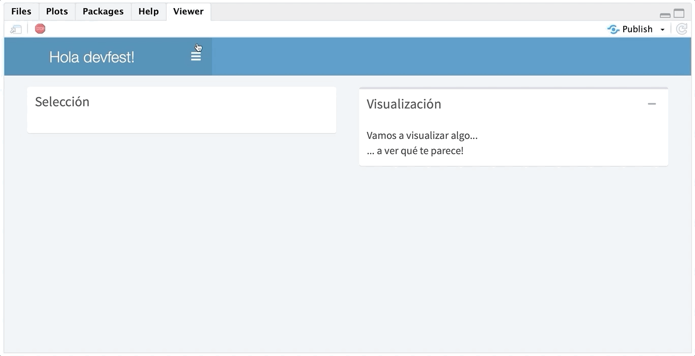

---

.pull-left[
## Enlaces a contenido externo
- Además de controlar las pantallas, `menuItem()` puede enlazar contenidos externos dándole valor a `href`
- Por defecto, los links externos se abren en una nueva pestaña del navegador pero este comportamiento puede controlarse con la opción `newtab`.

</br>
## Badges
Los `menuItem()` pueden añadir badges, utilizando `badgeLabel` y `badgeColor`
]

.pull-right[
</br>

```{r eval=FALSE}
library(shiny)
library(shinydashboard)

dashboardPage(
  ...
  dashboardSidebar(sidebarMenu(
      menuItem("Resumen", 
        tabName = "resumen", 
        icon = icon("dashboard")),
      menuItem("Saludo", 
        tabName = "saludo", 
        icon = icon("address-card")),
*      menuItem("devfest", 
*       badgeLabel = "new", 
*       badgeColor = "green",
*       href = "https://devfestspain.com/")
  )),
  ...
)
```

]

---

# Submenús
Además podemos incluir submenús utilizando `menuSubItem()`

```{r eval=FALSE}
library(shiny)
library(shinydashboard)
dashboardPage(
    ...
    dashboardSidebar(sidebarMenu(
        menuItem("Resumen", 
                 tabName = "resumen", 
                 icon = icon("dashboard")),
        menuItem("Saludo", tabName = "saludo", icon = icon("address-card")),
        menuItem("devfest", badgeLabel = "new", badgeColor = "green",
                 href = "https://devfestspain.com/"),
        menuItem("About", 
                 icon = icon("rocket"),
*                 menuSubItem("Consulta shiny",
*                             href = "https://shiny.rstudio.com"))
    )),
    ...
)
```

---
class: center, middle

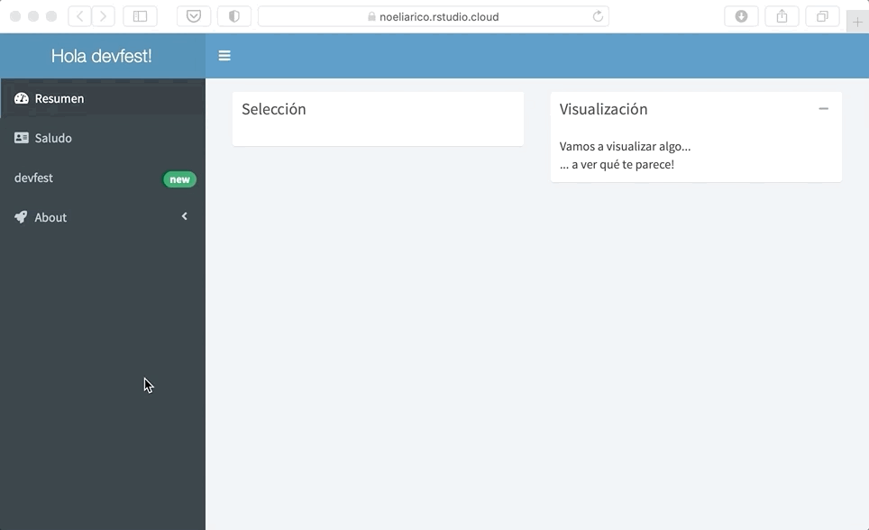

---
class: center, inverse, middle

# Contenido dinámico

---

</br>
# Programación reactiva
</br>

- En la mayoría de casos, necesitaremos crear contenido HTML en la parte del servidor que es enviado al cliente para ser renderizado. 
- En shiny, las expresiones reactivas permiten hacer webs [dinámicas](https://shiny.rstudio.com/tutorial/written-tutorial/lesson6/)

---

## `ui.R`

```{r eval=FALSE}
...
dashboardBody(tabItems(
        tabItem(tabName = "resumen",
                box(title = "Selección", 
                    solidHeader = TRUE,
*                    textOutput("output_escribir")),
                box(title = "Visualización", 
                    solidHeader = FALSE,
                    collapsible = TRUE,
                    "Vamos a visualizar algo...", 
                    br(), 
                    "... a ver qué te parece!",
*                    textInput("input_escribir", "Escribe un título")
                )
        ),
        tabItem(tabName = "saludo",
            h2("Hola 👩‍💻👨‍💻👋🤪🤗")
        )
    ))
...
```

---
class: center, middle

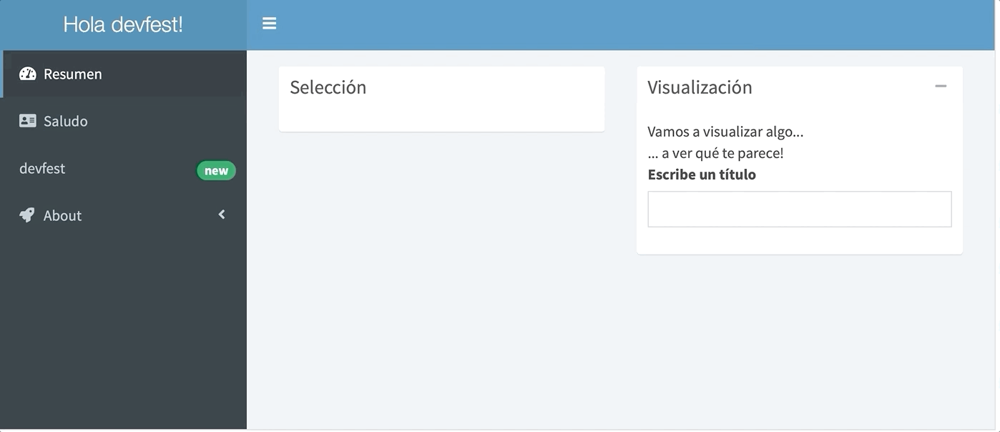

---

# Programación reactiva

</br>
No hemos codificado nada en la parte del server! 
</br></br>

## `server.R`

```{r eval =FALSE}
shinyServer(function(input, output) {
  
  output$output_escribir <- renderText({
    paste("Estás escribiendo:", input$input_escribir)
  })

})
```

---
class: center, middle

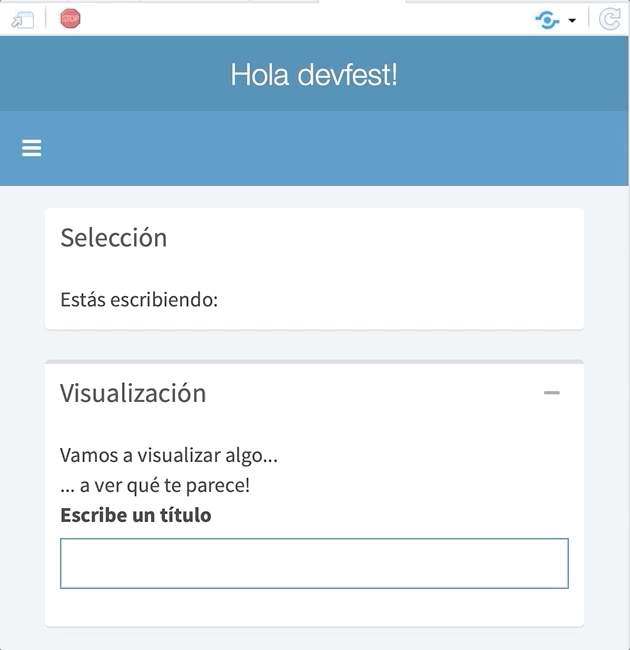

---

# Programación reactiva

La creación de interfaces reactivas es un proceso de dos pasos:

1. Añadir un objeto R en la interfaz de usuario
2. Decir a Shiny cómo construir el objeto en la parte del servidor.

El objeto será reactivo si el código para construirlo depende de algún valor de entrada.

</br>
### Conceptos

- Funciones **output**
- Funciones **render**
- Los objetos `input` y `output`

---

# Programación reactiva

Las funciones disponibles en Shiny son:</br>

.pull-left[

Funciones **output**:

- `dataTableOutput`	objetos DataTable
- `htmlOutput`	HTML plano
- `imageOutput`	imágenes
- `plotOutput`	plots
- `tableOutput`	tablas
- `textOutput`	texto
- `uiOutput`	raw HTML
- `verbatimTextOutput`	text
]

.pull-right[

Funciones **render**:

- `renderDataTable` objetos	DataTable
- `renderImage`	imágeness (guardadas como un link a un fichero)
- `renderPlot`	plots
- `renderPrint`	cualquier salida del `print` de un objeto
- `renderTable`	data frame, matrix, otros formatos table
- `renderText`	strings
- `renderUI`	una etiqueta Shiny o código HTML

]

---
class: center, middle, inverse

# Barra de menú superior

---
class: center, middle

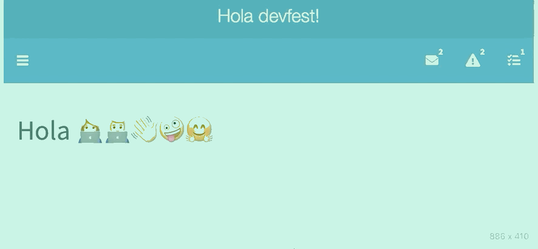

---

# Menús dropdown

```{r eval=FALSE}
...
dashboardHeader(title = "Hola devfest!",
*        dropdownMenu(type = "messages",
            messageItem(
                from = "Noelia",
                message = "devfest"),
            messageItem(
                from = "Otro usuario",
                message = "Pal' mundo",
                icon = icon("question"),
                time = "17/OCT/2020")),
*        dropdownMenu(type = "notifications",
                     notificationItem("Todo ok 😃", status = "success"),
                     notificationItem("Aunque cuidado!", status = "warning")),
*        dropdownMenu(type = "task",
                     taskItem(text = "Tu tarea princial",
                              value = 40))
        
    ),
...
```

---
class: center, middle, inverse

# Personalizar la aplicación

---

# Personalizando la aplicación

.pull-left[
```{r eval=FALSE}
tabItem(tabName = "resumen",
  box(title = "Selección", 
      solidHeader = TRUE,
*      status = "warning",
      textOutput("output_escribir")),
  box(title = "Visualización", 
      solidHeader = FALSE,
      collapsible = TRUE,
      "Vamos a visualizar algo...", 
      br(), 
      "... a ver qué te parece!",
      textInput("input_escribir", 
                "Escribe un título")
  )
)
```
]

.pull-right[

</br>

- Los objetos `box()` pueden ser [personalizados](http://rstudio.github.io/shinydashboard/appearance.html#statuses-and-colors)
- Ya conocíamos `solidHeader = TRUE`, y el botón de la esquina superior de la caja que nos permite desplegar y minimizar `collapsible = TRUE`
- Las cajas pueden tener cabeceras de colores y títulos. Los colores pueden obtenerse con `status`:
</br>
</br>
</br>


]


---
class: middle, center
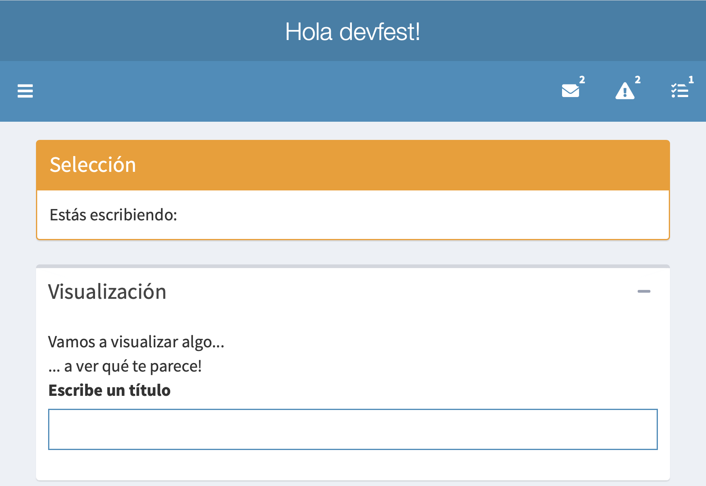

---

# Personalizando la aplicación

También se puede obtener un color de fondo utilizando la opción `background`. Los [colores disponibles](https://rstudio.github.io/shinydashboard/appearance.html#statuses-and-colors) son:
</br>
</br>

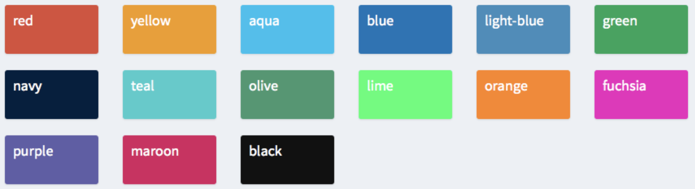

---

# Personalizando la aplicación

.pull-left[
```{r eval = FALSE}
tabItem(tabName = "resumen",
  box(title = "Selección", 
      solidHeader = TRUE,
*     status = "warning",
      textOutput("output_escribir")),
  box(title = "Visualización", 
*     background = "navy",
      collapsible = TRUE,
      solidHeader = TRUE,
*     status = "success",
      "Vamos a visualizar algo...", 
      br(), 
      "... a ver qué te parece!",
      textInput("input_escribir", "Escribe un título")
  )
        ),
```
]

.pull-right[
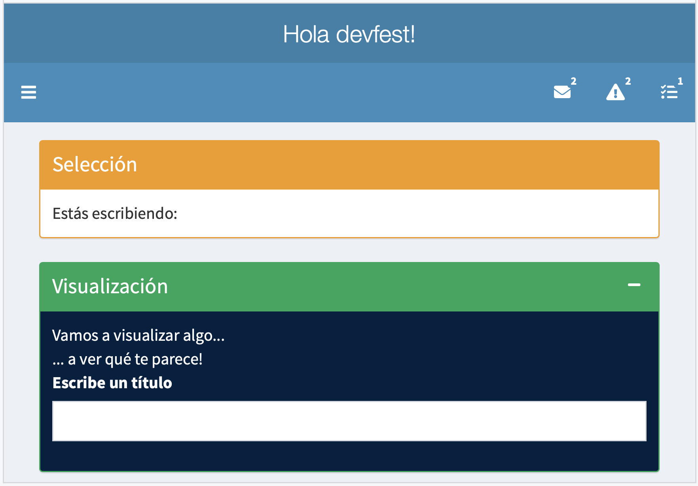
]

---

# Skins
</br>
Las [skins](https://rstudio.github.io/shinydashboard/appearance.html) permiten cambiar los colores de la aplicación utilizando `skin` y el valor deseado en `dashboardPage`

```{r eval=FALSE}
...
dashboardPage(skin = "black",
...
```

</br>

Los posibles valores para la skin son:

- blue
- black
- purple
- green
- red
- yellow

---
class: middle, center
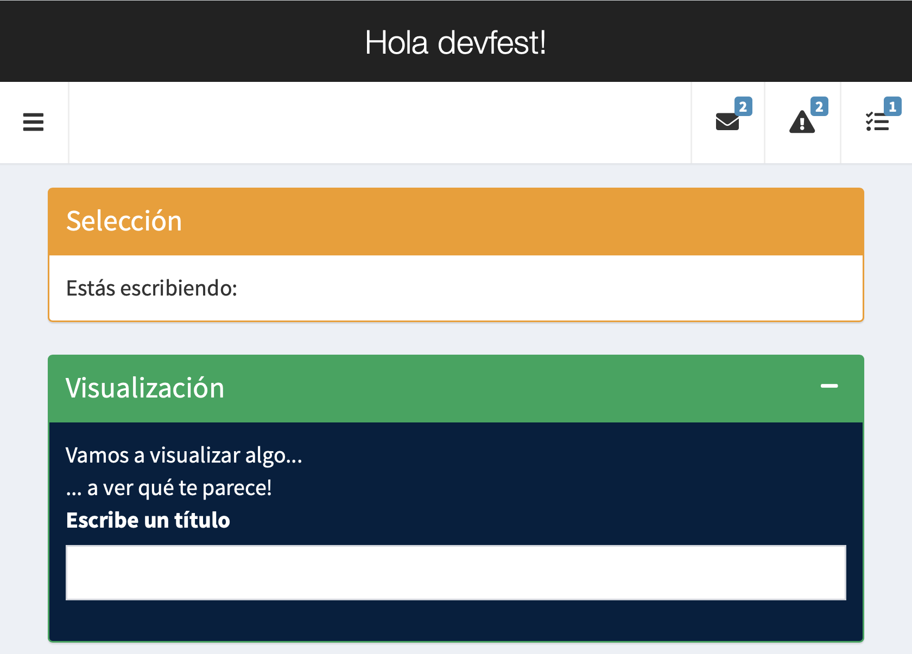

---

# Layouts

Colocar las cajas requiere un conocimiento mínimo 🤏 del *grid layout system* [Bootstrap](https://getbootstrap.com)

- El cuerpo de la página puede tratarse como una región divisible en 12 columnas de igual ancho
- Cada columna puede tener cualquier número de filas, de altura variable.
- La cantidad de columnas (del máximo de 12) que van a ocuparse puede ser especificado por el desarrollador

Acorde a esto, podemos definir:

- Layouts basados en filas
- Layouts basados en columnas

---

## Ejemplo: layout basado en filas

- Las cajas (objetos `box()`) van en filas creadas con `fluidRow()`
- Las filas tienen un grid de ancho 12. Por ejemplo:
  - Una caja con `width = 4` ocupa un tercio del ancho total.
  - Una caja con `width = 6` (que es el valor por defecto) ocupa la mitad del ancho total.
- Las cajas de una misma fila son alineadas en la parte superior pero la parte inferior puede no estar alneadas ya que dependen del contenido de la caja. 
- Es posible utilizar las cajas para que tengan la misma altura `height`.

---

```{r eval=FALSE}
library(shiny)
library(shinydashboard)

dashboardPage(
...
    dashboardSidebar(sidebarMenu(
...
        menuItem("Layouts", 
                 menuSubItem("Filas",
                             tabName = "filas"))
    )),
    dashboardBody(tabItems(
...
        tabItem(tabName = "filas",
            h2("Layout por filas"),
            fluidRow(
*                box(title = "Caja1-Fila1"),
*                box(title = "Caja2-Fila1"),
*                box(title = "Caja3-Fila1")
            ))
        
    ))
)

```

---
class: center, middle


---

# Ejemplo: layout basado en filas

```{r eval=FALSE}
...
dashboardSidebar(sidebarMenu(
...
  menuItem("Layouts", 
    menuSubItem("Filas",
    tabName = "filas"))
...
dashboardBody(tabItems(
...
  tabItem(tabName = "filas",
    h2("Layout por filas"),
    fluidRow(
        box(title = "Caja1-Fila1", width = 4),
        box(title = "Caja2-Fila1", width = 4),
        box(title = "Caja3-Fila1", width = 4)
  ))
...
```

---
class: center, middle


---

```{r eval=FALSE}
library(shiny)
library(shinydashboard)

dashboardPage(
...
    dashboardSidebar(sidebarMenu(
...
        menuItem("Layouts", 
                 menuSubItem("Filas",
                             tabName = "filas"))
    )),
    dashboardBody(tabItems(
...
        tabItem(tabName = "filas",
            h2("Layout por filas"),
            fluidRow(
                box(title = "Caja1-Fila1", width = 4),
                box(title = "Caja2-Fila1", width = 4),
                box(title = "Caja3-Fila1", width = 4)
            ),
*            fluidRow(
*               box(title = "Caja1-Fila2"),
*               box(title = "Caja2-Fila2"))
            )
        
    ))
)

```

---

class: center, middle


---

class: center, middle


---

# Alojar y desplegar la aplicación

- [Shinyapps.io](https://www.shinyapps.io/?_ga=2.25440189.1227262715.1602582389-21136314.1602582389)
- [Shiny Server](https://rstudio.com/products/shiny/shiny-server/)


- Desplegar y alojar en un servidor propio

Antes de [desplegar](https://shiny.rstudio.com/deploy/) la aplicación, es [necesario](https://shiny.rstudio.com/articles/execution-scheduling.html)  [instalar en el servidor que alojará la web](https://www.r-bloggers.com/2016/03/install-all-required-r-packages-on-your-shiny-server/) los paquetes que sean utilizados en el código.

---

```{r setup, include=FALSE}
options(htmltools.dir.version = FALSE)
```

```{css, echo = FALSE}

.remark-slide-content:after {
    content: "email:\00a0noeliarico@uniovi.es\00a0||\00a0twitter:\00a0@noeliarico_";
    position: absolute;
    bottom: 1px;
    left: 625px;
    height: 37px;
    width: 100px;
    color: #e7eff6;
    background-repeat: no-repeat;
    background-size: contain;
}

.pull-more-left {
  float: left;
  width: 69%;
}
.pull-less-right {
  float: right;
  width: 29%;
}

.small1 .remark-code { 
  font-size: 60% !important;
}

.small2 .remark-code { 
  font-size: 95% !important;
}
```

```{r xaringan-themer, include=FALSE, warning=FALSE}
library(xaringanthemer)
style_duo_accent(
  #primary_color = "#1381B0",
  #secondary_color = "#FF961C",
  primary_color = "#4b86b4",
  secondary_color = "#adcbe3",
  inverse_header_color = "#2a4d69"
)
```


# Referencias

- [Galería](https://shiny.rstudio.com/gallery/) de aplicaciones hechas con `shiny`
- Ejemplos de [aplicaciones shiny](https://github.com/rstudio/shiny-examples)
- Conocimientos [https://rstudio.cloud/learn/primers/1](básicos) de R
- [RStudio](https://datacarpentry.org/genomics-r-intro/01-introduction/index.html)
- Paquete shiny en [CRAN](https://cran.r-project.org/web/packages/shinydashboard/shinydashboard.pdf)
- Página principal del paquete [`shiny`]( https://shiny.rstudio.com)
- [The shiny cheat sheet](https://shiny.rstudio.com/articles/cheatsheet.html)

---
class: center, middle, inverse

# ¡GRACIAS!

noeliarico@uniovi.es

@noeliarico_

